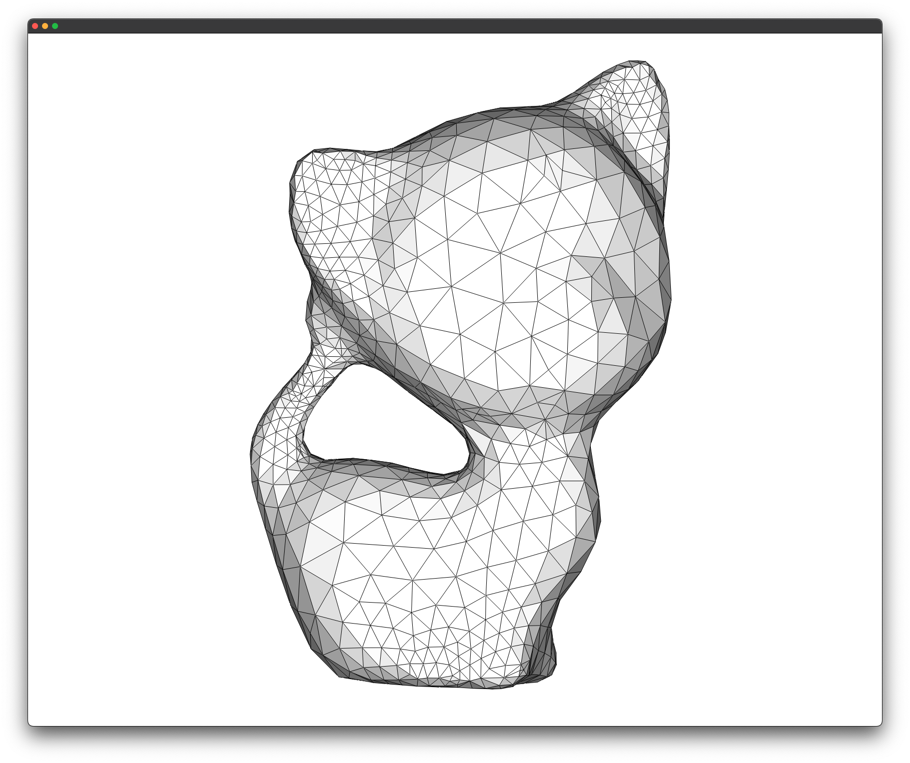
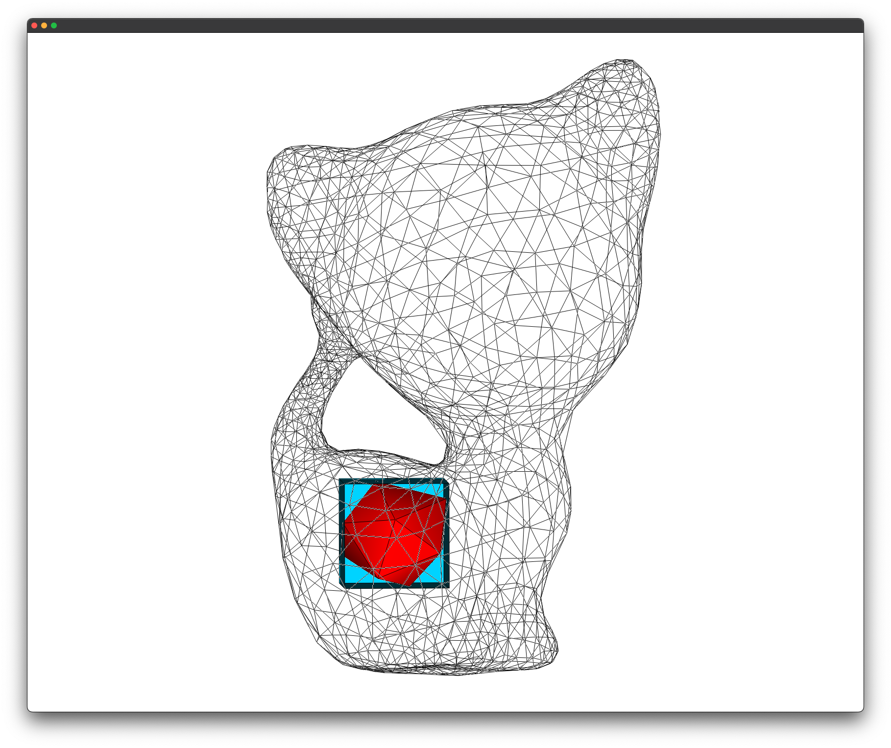
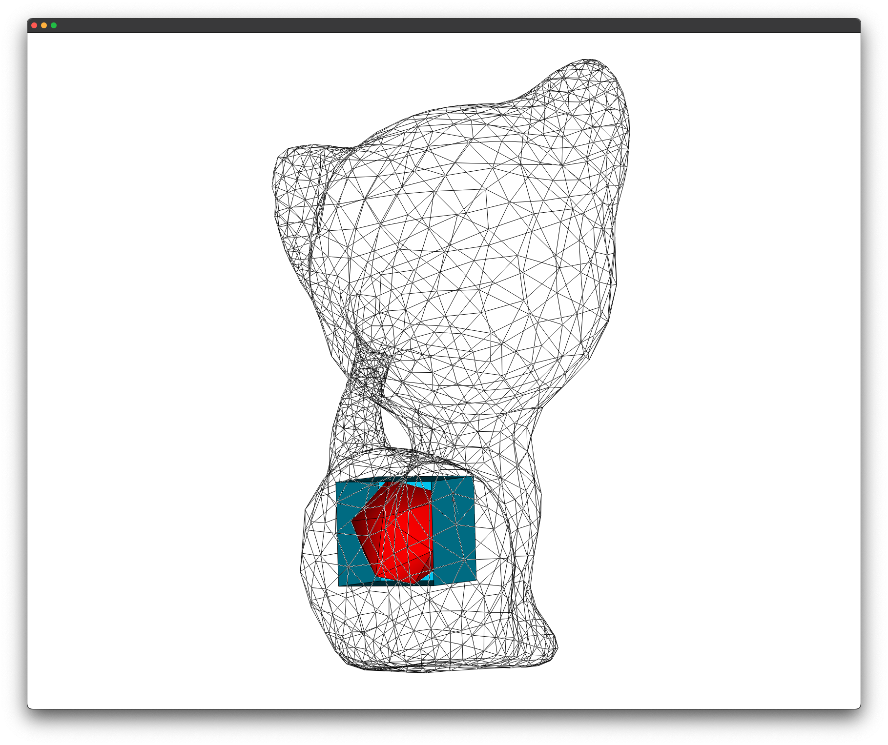

# Advancing Volumes

> Thesis project - **MD in Computer Science** (**Università degli Studi di Cagliari**)

| **Student**          | **ID**      | **E-Mail**                        |
|----------------------|-------------|-----------------------------------|
| Federico Meloni      | 60/73/65243 | <f.meloni62@studenti.unica.it>    |

## TODO
- [ ] check sphere scaling

## File structure
```
.
|
│ Folders
├── spheres             # tetrhedron spheres dataset
│   ├── sphere18.mesh
│   ├── sphere31.mesh
│   ├── sphere40.mesh
│   └── sphere50.mesh
│
│ Code file
├── main.cpp
├── sphere.cpp/h        # utility functions for getting the sphere mesh
├── text_utils.h        # utility macros for text output
│
│ Markdown
├── README.md
```

## Sphere placement
A sphere is placed inside the model at the point of maximum value of the distance field inside the model.
The point of maximum value of the distance field is the point at which there is the maximum minimum distance
from the surface (in our case among all the points at which the space inside the model was sampled).

For now, 4 types of spheres with increasing detail (18 / 31 / 40 / 50 tetrahedra) are made available.

These spheres also are scaled so that the bounding box of the sphere is tangent to the surface of the model.

|  |  |  |
|:-------------------------------:|:------------------------------------------:|:--------------------------------------------:|
| Model                           |     Model with sphere and bounding box     |      Model with sphere and bounding box      |